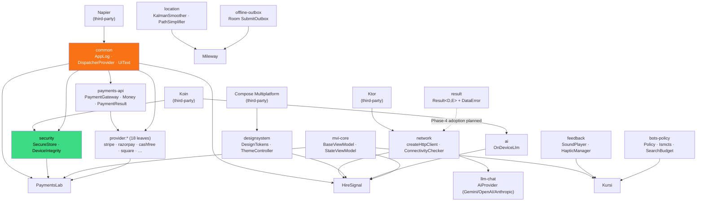
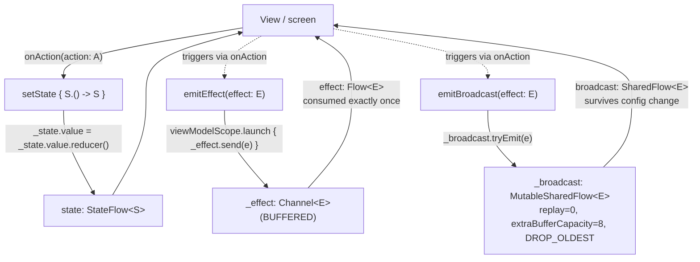

<div align="center">


### A Kotlin Multiplatform toolkit — a family of small, focused, production-grade libraries extracted from real apps.


**[Why](#why-kmp-toolkit)** · **[Highlights](#highlights)** · **[Modules](#modules)** · **[Architecture](#family-architecture)** · **[Tech stack](#tech-stack)** · **[Getting started](#getting-started)** · **[Roadmap](#roadmap)**

[**Portfolio**](https://cv-siddharth.vercel.app/) ·
[HireSignal](https://github.com/darkpandawarrior/HireSignal) ·
[PaymentsLab](https://github.com/darkpandawarrior/PaymentsLab) ·
[Mileway](https://github.com/darkpandawarrior/Mileway) ·
[Kursi](https://github.com/darkpandawarrior/Kursi) ·
[kmp-build-logic](https://github.com/darkpandawarrior/kmp-build-logic)

</div>

---

<details>
<summary><b>Contents</b></summary>

- [Why kmp-toolkit](#why-kmp-toolkit)
- [Highlights](#highlights)
- [Modules](#modules)
- [Family architecture](#family-architecture)
- [Tech stack](#tech-stack)
- [Getting started](#getting-started)
- [Install](#install)
- [result](#result)
- [common](#common)
- [mvi-core](#mvi-core)
- [network](#network)
- [security](#security)
- [designsystem](#designsystem)
- [ai](#ai)
- [llm-chat](#llm-chat)
- [feedback](#feedback)
- [location](#location)
- [payments-api](#payments-api)
- [provider:* (18 payment-gateway leaves)](#provider--18-payment-gateway-leaves)
- [offline-outbox](#offline-outbox)
- [bots-policy](#bots-policy)
- [secrets](#secrets)
- [Repository structure](#repository-structure)
- [Roadmap](#roadmap)
- [License](#license)

</details>

## Why kmp-toolkit

`kmp-toolkit` started as a monorepo consolidation of eight leaf libraries that had begun life as
separate repos, each extracted from a production app the moment its logic was needed a second time —
`mvi-core` out of Mileway's `core:ui`, `security` out of PaymentsLab's `core:security`, `network`
and `designsystem` and `ai` out of HireSignal's `core:*` modules, `feedback` out of Kursi. None of
them were designed up front as a "platform" — each is the smallest reusable slice of a real screen,
published once the second consumer showed up. `location` joined right after the merge, and the
monorepo has since grown to **32 modules**: `llm-chat` (cloud LLM chat), the `payments-api` +
18-provider payment-gateway family, `offline-outbox` (the first Room module here), and `bots-policy`
(a generic ISMCTS search shell) — see [Roadmap](#roadmap) for what shipped when.

Every module targets exactly the platforms its own consumers need — no module claims iOS support
it can't back up, no module ships a `wasmJs` target nobody asked for. Two deliberate inter-module
spines exist — `security → common` (for `AppLog`) and the `payments-api` ↔ `provider:*` gateway
contract — everything else is standalone by design, so adopting one leaf never drags in the rest.

Gradle convention plugins (the `androidKmpLibrary`, `composeCompiler` etc. plugins every
`build.gradle.kts` here applies) live in a separate repo,
[**kmp-build-logic**](https://github.com/darkpandawarrior/kmp-build-logic) — not part of this
monorepo.

## Highlights

- 🧩 **32 Gradle modules, one dependency graph.** 9 original leaves, `llm-chat` / `payments-api` /
  `offline-outbox` / `bots-policy`, and 18 `provider:*` payment-gateway leaves — every one published
  independently under `com.siddharth.kmp:<name>`, and a consumer only pulls in the modules it needs.
- 💳 **`payments-api` + 18 providers is a real gateway-abstraction exercise, not a toy.** One
  `PaymentGateway`/`PaymentBackend` contract in `payments-api`, then a thin Android-only adapter per
  provider (`stripe`, `razorpay`, `cashfree`, `square`, `mpesa`, `wallet`, `stripe-connect`,
  `hosted-webview`, …) — `StubGateway`/`SimulatedPayment` let the contract be exercised with zero live
  credentials.
- 🤖 **`llm-chat` talks to three real cloud LLM APIs** (Gemini, OpenAI, Anthropic) behind one
  `AiProvider` seam, reusing `:network`'s `httpClientEngine()` directly rather than its retry/timeout
  wrapper — a documented, deliberate choice (see the module's `build.gradle.kts` comment).
- 🗄️ **`offline-outbox` is the first Room module in the monorepo** — its own closed `@Database`
  (Room databases can't be spliced into a host app's), targeting `watchosArm64` /
  `watchosSimulatorArm64` / `watchosDeviceArm64` alongside Android/JVM/iOS because Mileway's
  `core:data` needs the outbox on watchOS too.
- ♟️ **`bots-policy` is a zero-dependency ISMCTS search shell**, extracted from Kursi's ai↔engine
  inversion — the generic search lives here, the game-specific rollout/leaf-eval stays in the app.
- 🔗 **One deliberate cross-leaf edge, everywhere else standalone.** `security → common` is the only
  `kmp-toolkit`-internal dependency between two original leaves; adopting one module never silently
  drags in a sibling.
- ✅ **CI runs the full multiplatform matrix on every push** — `assemble jvmTest testAndroidHostTest
  testDebugUnitTest` across all 32 modules, plus a dedicated no-AI-attribution check workflow.

## Modules

| Module | Coordinate | What it is | Platforms | Consumed by |
|---|---|---|---|---|
| [**result**](#result) | `com.siddharth.kmp:result` | `Result<D,E>` + `DataError` — typed, functional error handling | Android · JVM · iOS · Wasm | foundational — no consumers yet, Phase-4 adoption planned across the family |
| [**common**](#common) | `com.siddharth.kmp:common` | `AppLog` (Napier facade) + `DispatcherProvider` + `UiText` + `Formatters` | Android · JVM · iOS · Wasm | HireSignal, PaymentsLab (via `security`) |
| [**mvi-core**](#mvi-core) | `com.siddharth.kmp:mvi-core` | MVI ViewModel runtime — `BaseViewModel` / `StateViewModel` / `EffectEmitter` | Android · JVM · iOS · Wasm | HireSignal, PaymentsLab, Mileway, Kursi |
| [**network**](#network) | `com.siddharth.kmp:network` | Generic Ktor HTTP plumbing — client factory, retry, 401 handling, connectivity | Android · JVM · iOS | HireSignal (`core:network`) |
| [**security**](#security) | `com.siddharth.kmp:security` | Android app-hardening — Keystore, VAPT posture, `FLAG_SECURE` | Android only | PaymentsLab |
| [**designsystem**](#designsystem) | `com.siddharth.kmp:designsystem` | Brand-agnostic Compose Multiplatform primitives — tokens, theme controller, `MarkdownText` | Android · iOS · Wasm | HireSignal (`core:designsystem`) |
| [**ai**](#ai) | `com.siddharth.kmp:ai` | On-device LLM abstraction — ML Kit / MediaPipe / Foundation Models, one seam | Android · JVM · iOS | HireSignal (`core:ai`) |
| [**llm-chat**](#llm-chat) | `com.siddharth.kmp:llm-chat` | Cloud-LLM chat client — Gemini / OpenAI / Anthropic behind one `AiProvider` seam | Android · JVM · iOS · Wasm | new (`bb33d0c`), no dependents yet |
| [**feedback**](#feedback) | `com.siddharth.kmp:feedback` | Game-feel toolkit — synthesised sound + haptics, four real backends | Android · JVM · iOS · Wasm | Kursi |
| [**location**](#location) | `com.siddharth.kmp:location` | Pure GPS-track math — Kalman smoothing, path simplification, dynamic polling, fix-quality scoring | Android · JVM · iOS · Wasm | Mileway (`feature:tracking`) |
| [**payments-api**](#payments-api) | `com.siddharth.kmp:payments-api` | `PaymentGateway`/`PaymentBackend` contract, `Money`, `PaymentResult`, redaction, `StubGateway` | Android · JVM · iOS | the 18 `provider:*` leaves |
| [**provider:\***](#provider--18-payment-gateway-leaves) | `com.siddharth.kmp:provider-<name>` | 18 Android-only adapters implementing `payments-api`'s contract per gateway | Android only | reference integrations |
| [**offline-outbox**](#offline-outbox) | `com.siddharth.kmp:offline-outbox` | Room-backed submit-outbox — its own closed `@Database`, retry-on-reconnect | Android · JVM · iOS · watchOS | Mileway (`core:data`) |
| [**bots-policy**](#bots-policy) | `com.siddharth.kmp:bots-policy` | Generic ISMCTS search shell — `Policy`/`GameRules`/`Ismcts`/`SearchBudget`, zero deps | Android · JVM · iOS · Wasm | Kursi (ai engine) |
| [**secrets**](#secrets) | *(docs only, not a Gradle module)* | SOPS + age encrypted-secrets vault + alias manifest | — | reference pattern, no dependents |

## Family architecture



`security → common` is the only edge between two original `kmp-toolkit` leaves; `payments-api →
common` and every `provider:* → payments-api`/`provider:* → common` edge is the newer, equally
deliberate gateway-abstraction spine. Every module outside those two families is standalone:
dropping one into an app never drags in a sibling.

## Tech stack

| Layer | Technology |
|---|---|
| Language | Kotlin `2.4.20-Beta1` |
| Build | Android Gradle Plugin `9.4.0-alpha04`, KSP `2.3.10` |
| UI | Compose Multiplatform `1.12.0-beta01` (Material3 `1.12.0-alpha03`, BOM `2026.06.01`) |
| Networking | Ktor `3.5.1` (OkHttp / Darwin / CIO / Js engines) |
| DI | Koin `4.2.2` |
| Async | kotlinx-coroutines `1.11.0` |
| Persistence | Room `2.8.4` (KMP, `offline-outbox`) |
| Logging | Napier `2.7.1` |
| Testing | JUnit `4.13.2`, MockK `1.14.11`, Turbine `1.2.1`, Robolectric `4.16.1` |
| Publishing | GitHub Packages Maven (`com.siddharth.kmp`, version `1.0.0`) |
| CI | GitHub Actions — `ci.yml` (build+test matrix), `no-ai-attribution.yml` |

## Getting started

```bash
git clone https://github.com/darkpandawarrior/kmp-toolkit.git
cd kmp-toolkit

# Build + test everything CI runs, across every module
./gradlew assemble jvmTest testAndroidHostTest testDebugUnitTest --stacktrace

# Or scope to one module, e.g. while working on network
./gradlew :network:jvmTest
```

`settings.gradle.kts` uses `includeBuild("../kmp-build-logic")` for the convention plugins, so
[kmp-build-logic](https://github.com/darkpandawarrior/kmp-build-logic) must be checked out as a
sibling directory of `kmp-toolkit` before the first build. See [Install](#install) below for wiring
this repo — as a composite build or as published Maven coordinates — into a consuming app.

## Install

As a monorepo, `kmp-toolkit` collapses what used to be many separate `includeBuild` composite
builds (one `dependencySubstitution` block per leaf repo, each guarding against a `:lib` path
collision) into **one** `includeBuild` with one substitution per module:

```kotlin
// settings.gradle.kts
includeBuild("external/kmp-toolkit") {
    dependencySubstitution {
        substitute(module("com.siddharth.kmp:result")).using(project(":result"))
        substitute(module("com.siddharth.kmp:common")).using(project(":common"))
        substitute(module("com.siddharth.kmp:mvi-core")).using(project(":mvi-core"))
        substitute(module("com.siddharth.kmp:network")).using(project(":network"))
        substitute(module("com.siddharth.kmp:security")).using(project(":security"))
        substitute(module("com.siddharth.kmp:designsystem")).using(project(":designsystem"))
        substitute(module("com.siddharth.kmp:ai")).using(project(":ai"))
        substitute(module("com.siddharth.kmp:feedback")).using(project(":feedback"))
        substitute(module("com.siddharth.kmp:location")).using(project(":location"))
    }
}
```

Module paths are now natural — `:common`, `:network`, `:mvi-core`, and so on. Back when each module
was its own repo, every leaf had to publish a unique `<name>-lib` subproject path (`:common-lib`,
`:result-lib`, `:security-lib`, `:feedbacklib`, …) because Gradle's `dependencySubstitution`
resolves by path only, and two composite builds both exposing a bare `:lib` collided regardless of
`includeBuild` order. In a monorepo every module already has a distinct top-level path, so that
workaround is gone.

Consumers that resolve from Maven instead of building from source pull individual modules the plain
way, same coordinate per module:

```kotlin
// build.gradle.kts
dependencies {
    implementation("com.siddharth.kmp:common:1.0.0")
    implementation("com.siddharth.kmp:mvi-core:1.0.0")
    // ...one line per module actually needed
}
```

```kotlin
// settings.gradle.kts
dependencyResolutionManagement {
    repositories {
        maven {
            url = uri("https://maven.pkg.github.com/darkpandawarrior/kmp-toolkit")
            credentials {
                username = providers.gradleProperty("gpr.user").orNull
                password = providers.gradleProperty("gpr.key").orNull
            }
        }
    }
}
```

---

## result


`kotlin.Result` only carries a `Throwable` in its failure arm, which pushes callers back toward
`try`/`catch` and string-matching on messages. `result` types the failure arm as `E` — usually a
sealed [`DataError`](result/src/commonMain/kotlin/com/siddharth/kmp/result/DataError.kt) — so a
`when` over the error is exhaustive at compile time, and a ViewModel or repository can map, chain,
and react to failures with the same functional operators it already uses for the success path.

```kotlin
import com.siddharth.kmp.result.Result
import com.siddharth.kmp.result.DataError
import com.siddharth.kmp.result.map
import com.siddharth.kmp.result.flatMap
import com.siddharth.kmp.result.onSuccess
import com.siddharth.kmp.result.onFailure

fun fetchUser(id: String): Result<User, DataError> =
    if (id.isBlank()) Result.Failure(DataError.Local.NOT_FOUND) else Result.Success(User(id))

fun fetchProfile(id: String): Result<Profile, DataError> =
    fetchUser(id).flatMap { user -> loadProfile(user) }

fetchProfile("42")
    .map { it.displayName }
    .onSuccess { name -> println("Loaded $name") }
    .onFailure { error ->
        when (error) {
            DataError.Network.NO_INTERNET -> showOfflineBanner()
            DataError.Network.UNAUTHORIZED -> redirectToLogin()
            else -> showGenericError()
        }
    }

// Success-only payload discarded, keeping just success-vs-failure:
val saveResult: EmptyResult<DataError> = fetchProfile("42").asEmpty()
```

`DataError` is a `sealed interface` split into `Network` and `Local` enum arms; an app can extend it
with its own arms (e.g. a `Validation` error) by implementing the interface directly.

| Member | Signature | What it does |
|---|---|---|
| `Result.Success<D>` | `data class Success<out D>(val data: D)` | The success arm |
| `Result.Failure<E>` | `data class Failure<out E>(val error: E)` | The typed failure arm |
| `EmptyResult<E>` | `typealias EmptyResult<E> = Result<Unit, E>` | A result whose success carries no payload |
| `map` | `(D) -> R) -> Result<R, E>` | Transform the success value; failures pass through |
| `flatMap` | `(D) -> Result<R, E>) -> Result<R, E>` | Chain into another `Result`; failures short-circuit |
| `fold` | `(onSuccess, onFailure) -> R` | Collapse both arms into one value |
| `mapError` | `(E) -> F) -> Result<D, F>` | Transform the failure value; successes pass through |
| `onSuccess` / `onFailure` | `(D/E) -> Unit) -> Result<D, E>` | Side-effect, returns receiver for chaining |
| `getOrNull` / `errorOrNull` | `() -> D?` / `() -> E?` | Success or failure value, `null` on the other arm |
| `asEmpty` | `() -> EmptyResult<E>` | Discard the success payload |
| `DataError.Network` | enum | `REQUEST_TIMEOUT`, `TOO_MANY_REQUESTS`, `NO_INTERNET`, `SERVER_ERROR`, `SERIALIZATION`, `UNAUTHORIZED`, `FORBIDDEN`, `NOT_FOUND`, `CONFLICT`, `UNKNOWN` |
| `DataError.Local` | enum | `DISK_FULL`, `NOT_FOUND`, `UNKNOWN` |

`result` is standalone — zero dependencies on any other `kmp-toolkit` module — which is what makes
it the foundation the rest of the family is meant to build on. No module consumes it yet; it ships
first so the typed-error contract exists before `network` and `security` standardize their failure
arms on it in a later phase, instead of each inventing its own `sealed class` per app.

Pure Kotlin, `commonMain`-only — `Result` and `DataError` carry no coroutine, lifecycle, or platform
dependency, so every target (Android `minSdk 24` / `compileSdk 37`, JVM, iOS, `wasmJs` browser)
compiles from the same source set with nothing to bridge.

## common


Two things get reinvented in almost every KMP app: a logging call site, and a way to swap
`CoroutineDispatcher`s under test. `android.util.Log` doesn't exist in `commonMain`, so logging
either forks per-platform or every module ends up importing a third-party logger directly. And a
`ViewModel` or repository that calls `Dispatchers.IO` at the call site can't have its concurrency
substituted in a test.

`common` closes both gaps with the smallest possible surface: `AppLog`, a message-first facade over
[Napier](https://github.com/AAkira/Napier) so call sites never import Napier directly (the backend
is swappable in one place), and `DispatcherProvider`, an injectable dispatcher set so production
code takes dispatchers as a constructor parameter instead of reaching for a global.

```kotlin
import com.siddharth.kmp.common.AppLog
import com.siddharth.kmp.common.DispatcherProvider
import com.siddharth.kmp.common.StandardDispatchers
import kotlinx.coroutines.withContext

AppLog.d("loaded ${users.size} users", tag = "Repo")
AppLog.w("retrying after timeout", tag = "Repo")
AppLog.e("failed to save", throwable = e, tag = "Repo")

class UserRepository(
    private val dispatchers: DispatcherProvider = StandardDispatchers,
) {
    suspend fun load(): List<User> = withContext(dispatchers.io) {
        // ... blocking / IO work
    }
}

// In a test: substitute a StandardTestDispatcher-backed DispatcherProvider instead of
// StandardDispatchers, so withContext(dispatchers.io) runs on the test scheduler.
```

| Member | Signature | What it does |
|---|---|---|
| `AppLog.d` / `.i` | `(message: String, tag: String? = null)` | Debug / info log via `Napier.d` / `Napier.i` |
| `AppLog.w` / `.e` | `(message: String, throwable: Throwable? = null, tag: String? = null)` | Warn / error log via `Napier.w` / `Napier.e` |
| `DispatcherProvider` | `interface { main; default; io }` | The injectable dispatcher seam |
| `StandardDispatchers` | `object : DispatcherProvider` | `main` → `Dispatchers.Main`, `default`/`io` → `Dispatchers.Default` |

`StandardDispatchers.io` maps to `Dispatchers.Default`, not `Dispatchers.IO` — `Dispatchers.IO` is
JVM/Android-only and doesn't exist in `commonMain` for wasm/native. An Android-specific data layer
can bind a real `Dispatchers.IO`-backed `DispatcherProvider` for blocking IO if it ever needs one;
`StandardDispatchers` stays the multiplatform-safe default.

`common` has no dependency on any other `kmp-toolkit` module — it only pulls in Napier and
kotlinx-coroutines. `security` consumes it transitively for `AppLog`; HireSignal uses it app-wide.
`commonMain`-only implementation across Android (`minSdk 24` / `compileSdk 37`), JVM, iOS, and
`wasmJs` — only Napier's own platform backends differ underneath.

## mvi-core


Three small presentation-layer primitives kept getting re-copied between KMP projects (Mileway,
PaymentsLab, Kursi) every time a new screen needed unidirectional state. `mvi-core` pulls them out
once, extracted from Mileway's `core:ui` MVI base.

| Class | Use when | Depends on |
|---|---|---|
| `BaseViewModel<S, E, A>` | Full MVI screen: state + one-shot effects (nav/toast) + config-surviving broadcast + explicit `Action` type | `androidx.lifecycle.ViewModel` |
| `StateViewModel<S>` | Simple screen: just state, no one-shot effects yet | `androidx.lifecycle.ViewModel` |
| `EffectEmitter<E>` | One-shot effect delivery for a presenter that is **not** built on `androidx.lifecycle.ViewModel` | Plain `CoroutineScope`, nothing else |

Start with `StateViewModel`. Move to `BaseViewModel` the moment the screen needs a one-shot
navigation/toast effect. Reach for `EffectEmitter` standalone when the host isn't an
`androidx.lifecycle.ViewModel` at all.

`BaseViewModel<S, E, A>` runs two independent one-way loops out of the same `onAction`: a state loop
the screen reads on every recomposition, and a pair of effect channels with different delivery
guarantees. Names below match `mvi-core/src/commonMain/kotlin/com/siddharth/kmp/mvi/BaseViewModel.kt` exactly.



`StateViewModel<S>` is the same reducer loop with the two effect channels removed. `EffectEmitter<E>`
is just the `Channel<E>` branch, taking a caller-supplied `CoroutineScope` instead of
`viewModelScope`.

```kotlin
// module build.gradle.kts
dependencies {
    implementation("com.siddharth.kmp:mvi-core:1.0.0")
}
```

Targets: `androidTarget`, `jvm`, `iosArm64`, `iosSimulatorArm64`, `wasmJs` — the union PaymentsLab
and Kursi need. All three classes live in `commonMain`; `androidx.lifecycle:lifecycle-viewmodel`
publishes for every target in that union (including `wasmJs`), so no intermediate source set split
was needed.

**Technical notes, grounded in the actual source:**

- **State updates aren't CAS-guarded.** `setState` does `_state.value = _state.value.reducer()` — a
  plain `MutableStateFlow` assignment, not the compare-and-swap loop `MutableStateFlow.update { }`
  gives you. Fine under the contract this library assumes (one writer: whatever dispatches into
  `onAction`), but calling `setState` concurrently from two coroutines at once can lose an update —
  a real gap to close with `.update { }` if a screen ever needs multiple concurrent writers.
- **Two effect channels, two different delivery contracts.** `emitEffect` wraps a
  `Channel<E>(Channel.BUFFERED)` exposed as `effect: Flow<E>` via `receiveAsFlow()` — each value goes
  to exactly one collector and never repeats (right for navigation/toast, but unread if the screen
  isn't currently collecting). `emitBroadcast` instead `tryEmit`s into a
  `MutableSharedFlow<E>(replay = 0, extraBufferCapacity = 8, onBufferOverflow = DROP_OLDEST)` — no
  history for new subscribers, but it outlives a configuration-change screen recreation.
- **Coroutine scope is minimal, not incidental.** `viewModelScope` is only touched once, inside
  `emitEffect`, wrapping the suspending `Channel.send` so `onAction` itself doesn't need to be a
  suspend function; `emitBroadcast` needs no scope at all since `tryEmit` never suspends given the
  buffer above.
- **Build system detail:** the Android target is wired through AGP's own
  `com.android.kotlin.multiplatform.library` plugin, not the older `com.android.library` +
  `org.jetbrains.kotlin.multiplatform` combination — there's no explicit `androidTarget()` call.

## network



Every app that talks HTTP over Ktor re-solves the same handful of problems: content negotiation, a
sane retry policy, a request timeout that doesn't kill a long-lived stream, and a single choke point
that reacts to a 401 without looping on the login route itself. None of that is app-specific — it's
the same wiring whether the DTOs are job postings or payment orders.

`network` is that wiring, and nothing else. It ships a configured `HttpClient` factory, the platform
engine bindings (OkHttp / Darwin / CIO), a lenient shared `Json`, and three small seam interfaces
(`BaseUrlProvider`, `TokenProvider`, `UnauthorizedHandler`) so base URL and auth resolve at call
time. It deliberately carries **no** app API surface — endpoints, DTOs, and the typed API layer stay
in the consumer, same as `result` carries no app-specific error types.

```kotlin
import com.siddharth.kmp.network.createHttpClient
import com.siddharth.kmp.network.networkJson
import com.siddharth.kmp.network.BaseUrlProvider
import com.siddharth.kmp.network.TokenProvider
import io.ktor.client.request.get
import io.ktor.client.request.header
import io.ktor.client.call.body

// One shared client per process — content negotiation, INFO logging, retry, 30s timeout, and a
// 401 observer are all wired in.
val client = createHttpClient(onUnauthorized = { session.clearToken() })

class JobsApi(
    private val client: HttpClient,
    private val baseUrl: BaseUrlProvider,
    private val token: TokenProvider,
) {
    suspend fun listings(): List<JobDto> =
        client.get("${baseUrl.baseUrl()}/jobs") {
            token.token()?.let { header("Authorization", "Bearer $it") }
        }.body()
}

// The consumer's own serializer setup reuses the same lenient Json:
val decoded = networkJson.decodeFromString<JobDto>(rawJson)
```

`ConnectivityChecker` gates a `refresh()` before the network call is even made — bind
`AndroidConnectivityChecker(context)` on Android (real `ConnectivityManager` reachability, with
`NET_CAPABILITY_VALIDATED`) or `AlwaysOnlineConnectivityChecker` on jvm/iOS.

| Member | Signature | What it does |
|---|---|---|
| `createHttpClient` | `(engine: HttpClientEngine = httpClientEngine(), onUnauthorized: suspend () -> Unit = {}) -> HttpClient` | Content negotiation, INFO logging, bounded exponential-backoff retry on 5xx/IO failures, 30s request timeout, 401 observer (skips `/auth/` routes) |
| `networkJson` | `Json` | Lenient, forward-compatible: unknown keys ignored, defaults encoded, explicit nulls off |
| `BaseUrlProvider` | `fun interface { suspend fun baseUrl(): String }` | Resolves the server base URL per call |
| `TokenProvider` | `fun interface { suspend fun token(): String? }` | Resolves an optional bearer token per call |
| `UnauthorizedHandler` | `fun interface { suspend fun onUnauthorized() }` | Invoked once per 401 on a non-auth route |
| `ConnectivityChecker` | `interface { fun isOnline(): Boolean }` | Cheap online check to gate a sync/refresh |
| `AndroidConnectivityChecker` | `class(context: Context) : ConnectivityChecker` | Real `ConnectivityManager` reachability (Android) |
| `AlwaysOnlineConnectivityChecker` | `object : ConnectivityChecker` | Naive default (jvm/iOS) — lets the HTTP call fail-and-retry instead of probing |

Platform HTTP engines are wired transparently via `internal expect fun httpClientEngine()`: OkHttp
on Android, Darwin on iOS, CIO on JVM — `createHttpClient()`'s default argument picks the right one.

`network` is standalone — no dependency on any other `kmp-toolkit` module, only Ktor and
kotlinx-serialization. HireSignal's `core:network` module builds on it; the app layers its own typed
API + DTOs on top. Planned: mapping `HttpRequestRetry`/`ResponseException` failures onto `result`'s
`DataError.Network` arms, so a consumer's repository layer gets a typed `Result<D, DataError>`
straight out of the client instead of catching `ResponseException` itself.

Targets: Android (`minSdk 24` / `compileSdk 37`, OkHttp engine), JVM (CIO engine), iOS (Darwin
engine). No `wasmJs` — the OkHttp/Darwin/CIO engine split is JVM/Android/iOS by design; a browser
target would need the Ktor `Js` engine wired in separately.

## security


Payments and other sensitive-data apps on Android need the same handful of defenses every time:
encrypt what's saved, know when the device is compromised, stop a screenshot from leaking a card
number, and keep the reaction to all of that configurable per build (strict in release, lenient for
a VAPT auditor who needs to run on a rooted, hooked device on purpose).

`security` is that toolkit, extracted from a production payments app's `core:security` module. It's
**Android-only by nature, not by accident** — every defense here is a real `android.*` API
(`AndroidKeyStore`, `FLAG_SECURE`, `/proc/self/status`, `TrustManager` introspection), so there's no
`expect`/`actual` layer pretending this could run anywhere else.

Detection and enforcement are deliberately split: a `SecurityAuditor` only ever answers *"what did
we find?"* A `SecurityPolicy` answers *"what should we do about it?"*, driven by a swappable
`SecurityPosture` — so a release build can block on root while a compliance-test build only warns,
without touching a single detector.

**What's in the box:**

- **`SecureStore` / `KeystoreSecureStore`** — key/value secret storage; encrypts every value with
  AES-256-GCM under an `AndroidKeyStore` key that never leaves the TEE/StrongBox, and stores even
  the *keys* as SHA-256 hashes — a filesystem dump of the private prefs file is inert without the
  device's hardware-backed key.
- **`KeystoreCrypto`** — the explicit `AES/GCM/NoPadding` primitive behind the store: a hardware key
  generated once via `KeyGenParameterSpec`, an IV-prefixed `Base64(IV(12) || ciphertext+tag)` wire
  format, and a GCM auth tag that makes `decrypt()` double as a tamper check.
- **`DeviceIntegrity` / `AndroidDeviceIntegrity`** — root, emulator, and debugger posture as a
  `SecurityReport`. The matching rules (`isRootTag`, `isEmulatorBuild`) are pure top-level functions,
  JVM-unit-tested against known fingerprints, no device or Robolectric required.
- **`AntiDebugDetector`** — `Debug.isDebuggerConnected()`, `Debug.waitingForDebugger()`, and a
  `TracerPid` parse from `/proc/self/status` (harder to spoof than the `Debug.*` calls alone).
- **`AntiHookDetector`** — Frida/Xposed/LSPosed heuristics: suspicious thread names, a
  `/proc/self/maps` scan for loaded Frida/substrate libraries, a loopback connect attempt on Frida's
  default ports (`27042`/`27043`), and reflective probes for Xposed/LSPosed marker classes.
- **`AntiSslBypassDetector`** — introspects the platform's default `TrustManager` and
  `HostnameVerifier` for permissive/custom implementations, plus a memory-maps scan for known
  SSL-unpinning native libraries.
- **`SecurityAuditor` / `SecurityAudit`** — the one `suspend fun audit()` a launch sequence calls.
  Composes every detector above, applies `SecurityConfig` VAPT `bypass*` flags at the aggregation
  layer (detection stays fully logged even on a bypassed build — only the gate-feeding boolean is
  cleared).
- **`SecurityPolicy` / `SecurityPosture` / `SecurityDecision`** — a pure `(Audit, Posture) ->
  Decision` fold. Ships `SecurityPosture.strict()` (blocks on root/hook/SSL-bypass/debugger, warns on
  emulator) and `.lenient()` (dev/debug stance).
- **`AppSecurityManager` / `SecureScreen`** — the screen-facing trio: `FLAG_SECURE` (blocks
  screenshots/recording, blanks the recents thumbnail), tapjacking protection via
  `filterTouchesWhenObscured`, and a background-overlay hook re-asserting `FLAG_SECURE`.
  `SecureScreen` is the Compose-scoped equivalent for one composable.
- **`PaymentCertificatePinning`** — an OkHttp `CertificatePinner` config template for payment-gateway
  API hosts, with placeholder SPKI pins and the exact `openssl` one-liner to replace them.
- **`securityModule(config)`** — one Koin module wiring the entire graph.

```kotlin
// Application.onCreate
startKoin {
    androidContext(this@App)
    modules(securityModule(SecurityConfig(/* bypass* flags from BuildConfig for VAPT builds */)))
}

val appSecurityManager: AppSecurityManager by inject()
appSecurityManager.install(this) // once — re-flags FLAG_SECURE on background/foreground

// Activity.onCreate
appSecurityManager.applySecurityToActivity(this) // FLAG_SECURE + tapjacking protection

// Compose — screen-scoped FLAG_SECURE instead of the whole Activity
SecureScreen(enabled = true) {
    CardEntryScreen()
}

// Launch-time posture check, gating card entry on a compromised device
val auditor: SecurityAuditor by inject()
val audit = auditor.audit()
val decision = SecurityPolicy.evaluate(audit, SecurityPosture.strict())
if (decision.shouldBlock) {
    // refuse to load card entry — decision.summary() e.g. "ROOT→BLOCK, EMULATOR→WARN"
}

// Keystore-backed secret storage
val secureStore: SecureStore by inject() // KeystoreSecureStore under the hood
secureStore.putString("kmp_secure_store", token)
val saved = secureStore.getString("kmp_secure_store")
```

| Type | What it does |
|---|---|
| `SecureStore` / `KeystoreSecureStore` | AES-256-GCM key/value secret storage; keys stored as SHA-256 hashes |
| `KeystoreCrypto` | `AES/GCM/NoPadding` primitive — IV-prefixed Base64 wire format |
| `DeviceIntegrity` / `AndroidDeviceIntegrity` | Root, emulator, debugger posture → `SecurityReport` |
| `AntiDebugDetector` | `TracerPid`, `Debug.isDebuggerConnected()`, `FLAG_DEBUGGABLE` |
| `AntiHookDetector` | Frida thread names, `/proc/self/maps`, Frida ports, Xposed/LSPosed marker classes |
| `AntiSslBypassDetector` | Permissive `TrustManager`/`HostnameVerifier` introspection, native SSL-bypass libs |
| `SecurityAuditor` / `SecurityAudit` | One `suspend fun audit()` composing every detector |
| `SecurityPolicy` / `SecurityPosture` / `SecurityDecision` | Pure `(Audit, Posture) -> Decision`; `strict()` / `lenient()`, `ALLOW`/`WARN`/`BLOCK` |
| `AppSecurityManager` | `FLAG_SECURE`, tapjacking, background re-flag overlay |
| `SecureScreen` (Composable) | Screen-scoped `FLAG_SECURE` via `DisposableEffect` |
| `PaymentCertificatePinning` | OkHttp `CertificatePinner` template — placeholder SPKI pins |
| `securityModule(config)` | Koin module wiring the whole graph |

`security` depends on `common` for `AppLog` — its only cross-family dependency — and is consumed
today by PaymentsLab, which extracted it from its own former `core:security` module. Android only —
`compileSdk 37`, `minSdk 24`; deliberate, since every defense wraps a concrete `android.*` API with
no cross-platform equivalent.

## designsystem


A real design system is *branded* — its palette, logo mark and typography are the product. Those
belong in the app, not a shared library. But underneath the brand sits a layer that every Compose
Multiplatform app re-implements identically: a spacing/shape token scale, a dark-mode state holder
that survives process death, and a handful of brand-neutral building blocks.

`designsystem` is exactly that layer, and nothing brand-specific. It carries **no** palette, **no**
logo, **no** app typography — you keep those. It ships the plumbing you'd otherwise copy-paste into
every new app, so your own `AppTheme`/`AppPalette` is the only design code you actually write.

**Spacing/shape tokens** — one scale, no magic numbers scattered across screens:

```kotlin
import com.siddharth.kmp.designsystem.DesignTokens

Column(verticalArrangement = Arrangement.spacedBy(DesignTokens.Spacing.m)) {
    Card(shape = DesignTokens.Shape.card) { /* ... */ }
}
```

**Theme-mode controller** — dark-first, persists the user's choice through a swappable `ThemeStore`
seam (default is in-memory; bind a DataStore-backed `ThemeStore` in your DI so the choice survives
process death, with no change to callers):

```kotlin
import com.siddharth.kmp.designsystem.ThemeController

val theme = ThemeController(store = myDataStoreThemeStore) // or default InMemoryThemeStore
val isDark by theme.isDark.collectAsState()

MaterialTheme(colorScheme = if (isDark) MyAppDarkColors else MyAppLightColors) {
    // your app — designsystem never dictates the colors
}

// Settings toggle:
Switch(checked = isDark, onCheckedChange = { theme.setDark(it) })
```

**Building-block composables** — `MarkdownText` (a lightweight markdown → Compose renderer, tables
included) and `ComingSoonDialog` (a brand-neutral "not built yet" dialog):

```kotlin
MarkdownText("**Offer:** ₹32L · _remote_\n\n| role | level |\n|---|---|\n| Android | Lead |")
```

| Member | Kind | What it does |
|---|---|---|
| `DesignTokens` | `object` | Brand-agnostic spacing / shape / size scale |
| `ThemeStore` | `interface` | Persistence seam for the dark-mode choice (`darkOverride()` / `setDark()`) |
| `InMemoryThemeStore` | `object : ThemeStore` | Default seam — holds the choice for the process lifetime |
| `ThemeController` | `class` | Dark-first theme-mode state holder exposing `isDark: StateFlow<Boolean>`, `setDark()`, `toggle()` |
| `MarkdownText` | `@Composable` | Lightweight markdown → Compose renderer (headings, emphasis, lists, tables) |
| `ComingSoonDialog` | `@Composable` | Brand-neutral placeholder dialog |

`designsystem` depends only on Compose Multiplatform + coroutines — no other `kmp-toolkit` module.
An app layers its own brand (palette, logo, typography) and its app-coupled components on top; those
stay in the app, same reason `network` keeps your API and DTOs in the app. HireSignal's
`core:designsystem` adds `HireSignalPalette` / `HireSignalTheme` / status-colored components on top,
brand staying in-app.

Targets: Android (`minSdk 24` / `compileSdk 37`), iOS (`iosArm64`, `iosSimulatorArm64`), Wasm
(JS/browser). JVM/desktop isn't a target here (the consuming design systems don't need it); add
`jvm()` if yours does.

## ai


Every app that wants on-device inference hits the same wall: the backends are all different (ML Kit
GenAI / Gemini Nano on AICore devices, MediaPipe LLM Inference for broad Gemma coverage, Foundation
Models on iOS 26, nothing at all on desktop), each has its own residency/availability dance, and any
of them can just fail. The domain code that *uses* the model shouldn't know or care which one ran.

`ai` collapses all of that behind one seam: `OnDeviceLlm` — `isAvailable()` + `suspend fun
generate(prompt): String?`. `generate` returns `null` on any miss (no model resident, declined,
failed), so your caller degrades to its own heuristic tier instead of throwing. A
`CompositeOnDeviceLlm` chains backends in preference order and returns the first non-null answer.
Your feature-specific prompt-building and output-parsing stay in your app; this carries only the
plumbing to *run* a prompt.

```kotlin
import com.siddharth.kmp.ai.onDeviceLlmModule
import com.siddharth.kmp.ai.OnDeviceLlm

startKoin { modules(onDeviceLlmModule(), myFeatureModule) }

class JobSummarizer(private val llm: OnDeviceLlm) {
    suspend fun summarize(jd: String): String =
        llm.generate("Summarize this job description in one line:\n$jd")
            ?: heuristicSummary(jd) // graceful fallback — never throws
}
```

Compose your own backend order (e.g. add a remote tier) with `CompositeOnDeviceLlm`:

```kotlin
val llm: OnDeviceLlm = CompositeOnDeviceLlm(listOf(mlKitTier, mediaPipeTier, myRemoteTier))
// isAvailable() is true if ANY backend is; generate() returns the first non-null result.
```

| Member | Signature | What it does |
|---|---|---|
| `OnDeviceLlm` | `interface { fun isAvailable(): Boolean; suspend fun generate(prompt: String): String? }` | The single seam — text in, text out, `null` on any miss |
| `UnavailableOnDeviceLlm` | `object : OnDeviceLlm` | The always-off floor (desktop / pre-AI devices) |
| `CompositeOnDeviceLlm` | `class(backends: List<OnDeviceLlm>)` | Tries backends in order; first non-null wins |
| `onDeviceLlmModule` | `expect fun(): Module` | Per-platform Koin bindings for the right backend(s) |
| `ModelManager` | `interface { fun models(): List<ModelInfo>; fun observe(id): Flow<ModelInfo> }` | On-demand model download/residency status |
| `ModelInfo` / `ModelDownloadState` | data / enum | Model id, size, `ABSENT/DOWNLOADING/READY/FAILED`, progress |

Model files are **downloaded on demand at runtime**, never shipped in the repo.

`ai` is standalone — depends only on coroutines + Koin (and, on Android, the ML Kit GenAI +
MediaPipe SDKs). Your domain "intelligence" layer (prompt templates, output parsing, heuristics)
stays in your app and consumes this seam. HireSignal's `core:ai` builds `JobIntelligence` on top.

| Target | Backend |
|---|---|
| Android | ML Kit GenAI (Gemini Nano) → MediaPipe (Gemma), composed with fallback |
| iOS | Foundation Models seam (`iosArm64`, `iosSimulatorArm64`) |
| JVM / Desktop | `UnavailableOnDeviceLlm` — the heuristic tier upstream always answers |

## llm-chat

Every app that wants cloud LLM chat re-solves the same problem: three different HTTP APIs
(Anthropic, OpenAI, Gemini), three different auth headers and request shapes, and a fallback order
when a key is missing or a provider errors. `llm-chat` collapses that behind one `AiProvider` seam —
`complete(messages, config) -> String` plus `isAvailable()`.

```kotlin
import com.siddharth.kmp.llmchat.buildProviderChain
import com.siddharth.kmp.llmchat.firstAvailable
import com.siddharth.kmp.llmchat.AiMessage
import com.siddharth.kmp.llmchat.AiProviderConfig

val chain = buildProviderChain(
    config = AiProviderConfig(anthropicKey = key1, openAiKey = key2, geminiKey = key3),
    fallback = myHeuristicProvider,
)
val provider = firstAvailable(chain, fallback = myHeuristicProvider)
val reply = provider.complete(listOf(AiMessage(AiMessage.Role.USER, "Summarize this JD")))
```

| Member | Signature | What it does |
|---|---|---|
| `AiProvider` | `interface { complete(messages, config): String; isAvailable(): Boolean }` | The single seam every backend implements |
| `AnthropicProvider` / `OpenAiProvider` / `GeminiProvider` | `class(apiKey: String) : AiProvider` | Real HTTP clients against each vendor's chat-completion API |
| `buildProviderChain` | `(config, fallback, onDevice?) -> List<AiProvider>` | On-device (if supplied) → Anthropic → OpenAI → Gemini → fallback, skipping any blank key |
| `firstAvailable` | `suspend (chain, fallback) -> AiProvider` | First provider whose `isAvailable()` is true |

`llm-chat` deliberately reuses `:network`'s internal `httpClientEngine()` factory rather than its
`createHttpClient()` wrapper — the retry/backoff and 30s timeout in `network`'s wrapper would change
these providers' existing fire-and-forget request behavior, so the module brings its own
`ktor-client-core`/`content-negotiation` setup on top of the shared engine. Targets: Android, JVM,
iOS, `wasmJs`. Newest module in the repo (commit `bb33d0c`), no dependents yet.

## feedback


A card game lives or dies on game feel: a stamp needs a thud, a steal needs a heavier thud, a win
needs a fanfare, and a phone in someone's hand should buzz when a claim gets caught in a lie. None of
that has anything to do with any one screen — it's a cross-cutting concern that every platform
target of a KMP game needs the same small vocabulary for.

`feedback` is that vocabulary: a coarse, intentionally small set of `SoundKey`s and `HapticPattern`s
behind one `SoundPlayer` contract, with a **real, audible** actual on every target — including the
two platforms (JVM desktop, wasmJs web) that don't usually get game-feel treatment. Nothing is a
bundled asset; every sound is a few hundred bytes of synthesised PCM rendered at startup, so there's
no audio pipeline to wire and no `.wav` files to ship.

**What's in the box:**

- **`SoundKey`** — the SFX vocabulary: `Stamp` (rubber-stamp slam), `Coin` (economic actions),
  `Thud` (steals / heavier actions), `Win` (the fanfare). One per *feel*, not per moment.
- **`HapticPattern`** — the device-buzz vocabulary: `None`, `Tick` (light, routine), `Thud` (firm),
  `DoubleBuzz` (a "caught lying" reveal), `HeavyLong` (Coup / elimination / win).
- **`SoundPlayer`** — the `expect` contract: `playSound(key)`, `haptic(pattern)`, `release()`. Every
  method is fire-and-forget and must never throw — a missing audio device, a denied haptic
  permission, or a headless CI box all degrade to a silent no-op by contract, not by accident.
- **`defaultSoundPlayer()`** — the platform factory. Returns the real actual for whichever target is
  compiling.
- **`HapticManager`** — a small facade over `HapticPattern` for callers that think in terms of
  `HapticStyle` (`Light`/`Medium`/`Heavy`) or `HapticNotificationType` (`Success`/`Warning`/`Error`).
- **`ShareResult`** — `expect fun shareGameResult(text: String)`. Real on Android (an `ACTION_SEND`
  chooser Intent); a documented no-op on JVM/iOS/wasmJs today.
- **`NotificationPermissionState`** — a `StateFlow<NotificationPermission>` (`GRANTED` / `DENIED` /
  `NOT_ASKED`) any screen can observe, updated by the host app once it knows the real OS answer.
- **`NotificationChannelManager`** (Android) — creates the `game_invites` / `system`
  `NotificationChannel`s the app needs before posting a notification on API 26+.

```kotlin
// Android — install once so haptics can reach the system Vibrator (sound works without this)
FeedbackAndroid.install(applicationContext)

// Any platform — the one player instance for the app's lifetime
val player: SoundPlayer = defaultSoundPlayer()

// A claim gets stamped onto the felt
player.playSound(SoundKey.Stamp)
player.haptic(HapticPattern.Tick)

// A steal lands
player.playSound(SoundKey.Thud)
player.haptic(HapticPattern.Thud)

// Someone gets caught lying
player.haptic(HapticPattern.DoubleBuzz)

// Game over
player.playSound(SoundKey.Win)
player.haptic(HapticPattern.HeavyLong)
player.release() // idempotent — safe to call more than once

// Or via the style/notification-shaped facade
HapticManager.hapticImpact(HapticStyle.Medium)                  // -> HapticPattern.Thud
HapticManager.hapticNotification(HapticNotificationType.Success) // -> HapticPattern.HeavyLong

// Share a result (Android: real share sheet; other targets: documented no-op)
shareGameResult("Won as Trader — 3 coups survived")

// Observe the permission state a screen needs to react to
NotificationPermissionState.permission.collect { permission -> /* … */ }
```

| Type | What it does |
|---|---|
| `SoundKey` | SFX vocabulary — `Stamp`, `Coin`, `Thud`, `Win` |
| `HapticPattern` | Haptic vocabulary — `None`, `Tick`, `Thud`, `DoubleBuzz`, `HeavyLong` |
| `SoundPlayer` | `expect` contract — `playSound(key)`, `haptic(pattern)`, `release()`; never throws |
| `defaultSoundPlayer()` | Platform factory returning the real actual for the compiling target |
| `HapticManager` | `hapticImpact(HapticStyle)` / `hapticNotification(HapticNotificationType)` facade |
| `shareGameResult(text)` | `expect fun` — real Android share-sheet Intent; no-op elsewhere today |
| `NotificationPermissionState` | `StateFlow<NotificationPermission>` — `GRANTED`/`DENIED`/`NOT_ASKED` |
| `NotificationChannelManager` (Android) | Creates the `game_invites` / `system` notification channels |
| `FeedbackAndroid.install(context)` | Optional Android hook — unlocks the real system `Vibrator` for haptics |

Every target genuinely produces sound or haptics — nothing is a silent stub by default:

| Target | Sound | Haptics |
|---|---|---|
| **JVM** (desktop) | `javax.sound.sampled` — PCM tone synth streamed on a `SourceDataLine` | No-op (no vibration motor) |
| **Android** | Synthesised PCM streamed on a short-lived `AudioTrack` — no bundled assets, no `Context` required | Real `Vibrator`/`VibratorManager` (`VibrationEffect` on API 26+) once `FeedbackAndroid.install()` is called |
| **iOS** | In-memory WAV built from synthesised samples, played via `AVAudioPlayer` | `UIImpactFeedbackGenerator` (light/medium/heavy) + `UINotificationFeedbackGenerator` for `DoubleBuzz` |
| **wasmJs** (web) | Web Audio oscillator beep via a `@JsFun` bridge — degrades silently pre-user-gesture or without `AudioContext` | `navigator.vibrate` where supported; silent no-op on desktop browsers |

`feedback` has no dependency on another `kmp-toolkit` module — `commonMain` only reaches for
`kotlinx-coroutines-core`. It's consumed by Kursi, the family's KMP card game.

## location


Pure, allocation-light GPS-track math — the reusable core of a real offline-first tracking engine,
with **zero** platform or coroutine dependencies (only `kotlin.math`), so it runs identically on
Android, iOS, desktop and the browser. The location *service* (foreground service, sensors, GMS
activity recognition) and the app's `LocationData` model stay in the app; this is just the math.

- **`KalmanSmoother`** — a 2-D constant-velocity Kalman filter over lat/lng with per-fix measurement
  noise derived from GPS accuracy; smooths a jittery fix stream toward the true path. `smooth(lat,
  lng, accuracyMeters, timestampMs)` → smoothed `(lat, lng)`; `reset()` between journeys.
- **`PathSimplifier`** — Douglas–Peucker simplification (`GeoPoint` list) for *rendering only*, with
  named `Epsilon` presets. Never use the simplified path for distance — it drops 5–25% of length.
- **`DynamicIntervalCalculator`** — picks the next GPS polling interval from speed/activity/harsh-accel
  inputs (`IntervalInputs`), trading battery against fix density.
- **`TrackingQualityScorer`** — a *live* fix-quality score (`QualityInputs`) for a tracking
  notification / quality chip, scored as conditions happen rather than post-hoc.

```kotlin
import com.siddharth.kmp.location.KalmanSmoother

val kalman = KalmanSmoother(processNoiseMetersPerSec = 1.0)
locationUpdates.collect { fix ->
    val (lat, lng) = kalman.smooth(fix.lat, fix.lng, fix.accuracyMeters, fix.timeMs)
    // persist / render the smoothed point
}
```

| Member | Kind | What it does |
|---|---|---|
| `KalmanSmoother` | `class` | 2-D constant-velocity Kalman smoothing of a GPS fix stream |
| `PathSimplifier` | `object` | Douglas–Peucker path simplification (render-only) over `GeoPoint` |
| `DynamicIntervalCalculator` | `object` | Battery-vs-density GPS polling interval from `IntervalInputs` |
| `TrackingQualityScorer` | `object` | Live fix-quality score from `QualityInputs` |

`location` depends on no other `kmp-toolkit` module and no third-party library. Consumed by Mileway's
`feature:tracking`.

## payments-api

The contract every `provider:*` leaf implements: `PaymentGateway.prepare(order)` does the
server-round-trip step, `PaymentGateway.pay(host, prepared)` launches the provider's SDK/UI and
suspends until a terminal `PaymentResult`. Splitting the two keeps the network step unit-testable
without a device, and keeps the messy Activity-callback SDK reality confined to each provider's
`androidMain`.

```kotlin
import com.siddharth.kmp.paymentsapi.PaymentGateway
import com.siddharth.kmp.paymentsapi.PaymentResult

suspend fun charge(gateway: PaymentGateway, order: CreatedOrder, host: PaymentHost): PaymentResult {
    val prepared = gateway.prepare(order)
    return when (val result = gateway.pay(host, prepared)) {
        is PaymentResult.Success -> result // still just a client hint — verify server-side
        is PaymentResult.Failure -> result
        is PaymentResult.Pending -> result  // e.g. UPI SUBMITTED — poll the backend
        is PaymentResult.Cancelled -> result
    }
}
```

| Member | Kind | What it does |
|---|---|---|
| `PaymentGateway` | `interface` | `prepare(order) -> PreparedPayment`, `pay(host, prepared) -> PaymentResult` |
| `PaymentResult` | `sealed interface` | `Success` / `Failure` / `Pending` / `Cancelled`, each carrying a `RedactedPayload` |
| `GatewayStatus` | `enum` | `SANDBOX_READY`, `MOCK_MODE`, `KYC_GATED`, `COMING_SOON` — honest per-provider runnability |
| `Capability` | `enum` | `ONE_TIME_PAYMENT`, `UPI`, `CARDS`, `WALLET`, `NET_BANKING`, `REFUND`, `MANDATE` |
| `Money` | `data class` | Amount + currency, the shared money type across every provider |
| `StubGateway` / `SimulatedPayment` | class | A runnable fake gateway — exercises the whole contract with zero live credentials |
| `Redactor` / `RedactedPayload` | class | Strips secrets from a provider's raw SDK response before it's surfaced anywhere |

The `GatewayStatus` enum is the module's honesty mechanism: `MOCK_MODE` providers run their full
lifecycle against a mock backend (no live credentials needed to demo), `KYC_GATED` providers ship
real integration code with catalog/docs only (business onboarding required to actually run),
`COMING_SOON` is unimplemented. `payments-api` depends on `common` (for `UiText` on
`PaymentResult.Failure`/`PaymentStep.Errored`) — its only cross-family dependency. Targets: Android,
JVM, iOS.

## provider:* (18 payment-gateway leaves)

Eighteen Android-only leaf modules, one per gateway, each implementing `payments-api`'s
`PaymentGateway` contract against a real SDK: `stripe`, `stripe-connect`, `razorpay`, `cashfree`,
`square`, `omise`, `paystack`, `paytm`, `peach`, `nmi`, `xendit`, `flutterwave`, `googlepay`,
`upi-intent`, `cash`, `mobile-money`, `mpesa`, `wallet`, and `hosted-webview` (a Compose-WebView
generic hosted-checkout leaf via `compose-webview-multiplatform`, for gateways with no native SDK).

```kotlin
// provider:stripe/build.gradle.kts — the shape every leaf follows
dependencies {
    implementation(project(":payments-api")) // the PaymentGateway contract
    implementation(project(":common"))       // AppLog
    implementation(libs.stripe.paymentsheet)
    implementation(libs.play.services.wallet) // Google Pay rides Stripe as gateway of record
}
```

Every leaf depends on `payments-api` (the contract) and `common` (logging), then whatever
vendor-specific SDK it wraps — `stripe.paymentsheet` + `play-services-wallet` for `stripe`,
`razorpay.checkout` for `razorpay`, `cashfree.pg-api`/`cashfree.pg-ui` from Cashfree's own Maven repo
for `cashfree`, `robolectric` for host-side unit tests in a couple of leaves. None of the 18 leaves
depend on each other. All Android-only — `compileSdk 37` / `minSdk 24` — since every leaf wraps a
concrete Android SDK/Activity-callback surface, same reasoning as `security`.

## offline-outbox

The first Room module in the monorepo. A submit-and-retry outbox for offline-first writes — queue a
mutation locally, retry it when connectivity returns, without ever touching a host app's own `@Room
Database` (Room databases are closed; this module owns a private one-entity `@Database` of its own,
see `OutboxDatabase.kt`).

```kotlin
// module build.gradle.kts
plugins {
    alias(libs.plugins.ksp)
    alias(libs.plugins.room)
}
room { schemaDirectory("$projectDir/schemas") }
```

Targets: Android, JVM, iOS, **and watchOS** (`watchosArm64`, `watchosSimulatorArm64`,
`watchosDeviceArm64`) — Mileway's `core:data` re-exports the outbox through `commonMain` and targets
watchOS too, so this module has to match that target set, sharing `appleMain` actuals between iOS and
watchOS. Depends on Room `2.8.4` + `sqlite-bundled` (Android) and kotlinx-serialization; no other
`kmp-toolkit` module. Consumed by Mileway (`core:data`).

## bots-policy

A zero-dependency ISMCTS (Information Set Monte Carlo Tree Search) search shell, extracted from
Kursi's ai↔engine inversion: the generic search primitives (`Policy`, `GameRules`, `Ismcts`,
`SearchBudget`) live here, and the game-specific rollout policy / leaf evaluation / determinization
stays in the consuming app — this module never sees a card, a coin, or a Coup-specific rule.

```kotlin
// module build.gradle.kts — no dependencies beyond kotlin("test") in commonTest
plugins {
    alias(libs.plugins.kotlinMultiplatform)
    alias(libs.plugins.androidKmpLibrary)
}
```

| Member | Kind | What it does |
|---|---|---|
| `Policy` | `interface` | The game-agnostic decision seam a bot implements |
| `GameRules` | `interface` | Legal-move / terminal-state contract the search walks |
| `Ismcts` | `class` | The information-set MCTS search loop itself |
| `SearchBudget` | data | Iteration/time budget controlling how long a search runs |

`bots-policy` has zero third-party or cross-module dependencies — genuinely `commonMain`-only Kotlin,
no coroutine or platform surface. Targets: Android, JVM, iOS, `wasmJs`. Consumed by Kursi's AI
engine.

## secrets


`secrets` isn't a Gradle module — it's a standalone SOPS+age encrypted-secrets vault and alias
manifest, demonstrating the "vault mode" secret-resolution model:

```
alias -> vault entry -> sops+age decrypt -> materialize.at path
```

It's a self-contained demo/reference vault, not wired into any production app; its relationship to
the rest of `kmp-toolkit` is by pattern, not by `implementation(...)`.

**Layout:**

```
.sops.yaml                          # which files get encrypted, to which age recipient(s)
alias-manifest.yaml                 # logical name -> vault key -> where it lands on disk
vault/
  example.secrets.yaml              # plaintext fixture (fictional values) — the pre-encryption source
  example.secrets.enc.yaml.sample   # illustrative-only: what the encrypted file's shape looks like
test.sh                             # round-trip check (live if sops+age installed, else documents steps)
```

**The flow:** generate an age identity once (`age-keygen -o ~/.config/sops/age/keys.txt`), add the
public `age1...` key as a recipient in `.sops.yaml`, encrypt with `sops -e vault/example.secrets.yaml
> vault/example.secrets.enc.yaml` (commit the encrypted file, never the plaintext once it holds
anything real), and decrypt with `sops -d vault/example.secrets.enc.yaml`. A resolver looks up an
alias in `alias-manifest.yaml`, decrypts the named vault file, reads the `vault_key` path out of the
decrypted YAML, and writes it to the `materialize.at` target on disk.

`./test.sh` round-trips the whole flow: if `sops`/`age-keygen` are installed it generates a
throwaway identity, encrypts, decrypts, and asserts byte-for-byte equality (`brew install sops age`
to run it live); if either tool is missing it prints the manual steps and exits 0 — a missing local
tool isn't a failure of this repo.

**No real secrets or private keys live in this repo** — every value under `vault/` is fictional, and
the age key referenced in `.sops.yaml` is a placeholder string. Never commit a real private age
identity (`*.age`, `key.txt`, `*.agekey`, `keys.txt`, anything under `keys/`), a real
decrypted/materialized secret, or real values in `vault/example.secrets.yaml`.

## Repository structure

```
kmp-toolkit/
├── result/                  # Result<D,E> + DataError — Android · JVM · iOS · Wasm
├── common/                  # AppLog + DispatcherProvider — Android · JVM · iOS · Wasm
├── mvi-core/                # BaseViewModel / StateViewModel / EffectEmitter — Android · JVM · iOS · Wasm
├── network/                 # createHttpClient + connectivity — Android · JVM · iOS
├── security/                # Keystore, VAPT posture, FLAG_SECURE — Android only
├── designsystem/            # DesignTokens, ThemeController, MarkdownText — Android · iOS · Wasm
├── ai/                      # OnDeviceLlm seam — Android · JVM · iOS
├── llm-chat/                # Cloud-LLM chat client (Gemini/OpenAI/Anthropic) — Android · JVM · iOS · Wasm
├── feedback/                # SoundPlayer, HapticManager — Android · JVM · iOS · Wasm
├── location/                # KalmanSmoother, PathSimplifier — Android · JVM · iOS · Wasm
├── payments-api/            # PaymentGateway contract, Money, PaymentResult — Android · JVM · iOS
├── provider/                # 18 Android-only gateway leaves (stripe, razorpay, cashfree, square, …)
├── offline-outbox/          # Room SubmitOutbox — Android · JVM · iOS · watchOS
├── bots-policy/             # Generic ISMCTS search shell — Android · JVM · iOS · Wasm
├── secrets/                 # SOPS+age vault + alias manifest (docs only, not a Gradle module)
├── docs/
│   └── assets/               # main + per-module animated banner SVGs
├── gradle/                   # version catalog (libs.versions.toml)
├── gradle.properties
├── gradlew / gradlew.bat
└── README.md                 # this file
```

Gradle convention plugins (`androidKmpLibrary`, `composeCompiler`, etc.) applied across the modules
above live in a separate repo, [kmp-build-logic](https://github.com/darkpandawarrior/kmp-build-logic).

## Roadmap

**Shipped**
- [x] 9 original leaves extracted from HireSignal / PaymentsLab / Mileway / Kursi (`result`,
      `common`, `mvi-core`, `network`, `security`, `designsystem`, `ai`, `feedback`, `location`)
- [x] `llm-chat` — cloud LLM chat client (Gemini / OpenAI / Anthropic) (`bb33d0c`)
- [x] `payments-api` + 18 `provider:*` gateway leaves — one contract, sandbox-honest `GatewayStatus`
- [x] `offline-outbox` — first Room module in the monorepo, targeting watchOS alongside Android/JVM/iOS
- [x] `bots-policy` — zero-dependency ISMCTS search shell extracted from Kursi
- [x] CI matrix (`assemble jvmTest testAndroidHostTest testDebugUnitTest`) + no-AI-attribution check
- [x] GitHub Packages publishing under `com.siddharth.kmp`

**Exploring**
- [ ] Route `network`'s `HttpRequestRetry`/`ResponseException` failures onto `result`'s
      `DataError.Network` arms, so `result` stops being a foundation with zero consumers
- [ ] `payments-api` → `result`'s typed `Result<D, DataError>` instead of its own `PaymentResult` shape
- [ ] `llm-chat` wired into `ai`'s `CompositeOnDeviceLlm` fallback chain as a cloud tier
- [ ] Move some `provider:*` leaves off `SANDBOX_READY`/`MOCK_MODE` as partner KYC access opens up

## License

MIT — see [LICENSE](LICENSE). Part of the [kmp-toolkit](https://cv-siddharth.vercel.app/) family;
convention plugins in [kmp-build-logic](https://github.com/darkpandawarrior/kmp-build-logic).
[Portfolio](https://cv-siddharth.vercel.app/).

---

<div align="center">

[**Portfolio**](https://cv-siddharth.vercel.app/) ·
[HireSignal](https://github.com/darkpandawarrior/HireSignal) ·
[PaymentsLab](https://github.com/darkpandawarrior/PaymentsLab) ·
[Mileway](https://github.com/darkpandawarrior/Mileway) ·
[Kursi](https://github.com/darkpandawarrior/Kursi) ·
[kmp-build-logic](https://github.com/darkpandawarrior/kmp-build-logic)

</div>
