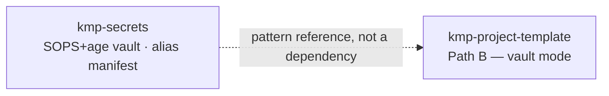

<div align="center">


### A standalone SOPS+age secrets vault and alias manifest — demonstrating the "vault mode" secret-resolution model, no live secrets, nothing to run in production.


[**Portfolio**](https://cv-siddharth.vercel.app/) · reference vault for [`kmp-project-template`](../kmp-project-template) · part of the **kmp-toolkit** family

</div>

---

A standalone SOPS+age secrets vault + alias manifest, demonstrating the
"Path B — vault mode" secret-resolution model used by
[`kmp-project-template`](../kmp-project-template) (see its
`deployment/BOOTSTRAP.md` and `docs/claude/secrets-management.md`):

```
alias -> vault entry -> sops+age decrypt -> materialize.at path
```

This repo is self-contained and standalone — it is a demo/reference vault,
not wired into any production app.

## Layout

```
.sops.yaml                          # which files get encrypted, to which age recipient(s)
alias-manifest.yaml                 # logical name -> vault key -> where it lands on disk
vault/
  example.secrets.yaml              # plaintext fixture (fictional values) — the pre-encryption source
  example.secrets.enc.yaml.sample   # illustrative-only: what the encrypted file's shape looks like
test.sh                             # round-trip check (live if sops+age installed, else documents steps)
```

`vault/example.secrets.enc.yaml` (no `.sample`) is what you'd commit as the
real encrypted artifact once you've actually run `sops -e` — it doesn't exist
here yet because this repo was populated in an environment without `sops`/
`age` installed. See `vault/example.secrets.enc.yaml.sample` for the expected
shape, and the flow below for how to produce the real thing.

**No real secrets or private keys live in this repo.** Everything under
`vault/` uses fictional placeholder values. The age key referenced in
`.sops.yaml` is a placeholder string, not a real key.

## The flow: generate age key -> encrypt -> decrypt -> resolve alias

### 1. Generate an age identity (one-time, per person/machine)

```bash
age-keygen -o ~/.config/sops/age/keys.txt
grep '^# public key:' ~/.config/sops/age/keys.txt
# -> age1... (this is your PUBLIC recipient key — safe to share/commit)
```

The rest of that file is your **private** identity — never commit it, never
share it. `sops` reads it automatically from `~/.config/sops/age/keys.txt`,
or via `SOPS_AGE_KEY_FILE=/path/to/keys.txt`.

### 2. Add your public key as a recipient

Edit `.sops.yaml` and replace the placeholder `age1PLACEHOLDER...` recipient
under `creation_rules` with your real `age1...` public key (add more entries
to the list for additional recipients/maintainers).

### 3. Encrypt

```bash
sops -e vault/example.secrets.yaml > vault/example.secrets.enc.yaml
```

`sops` reads `.sops.yaml`, matches the file path against `creation_rules`,
and encrypts every leaf value to the configured age recipient(s). Commit
`vault/example.secrets.enc.yaml` — never the plaintext `.yaml` source once
it holds anything real.

### 4. Decrypt

```bash
sops -d vault/example.secrets.enc.yaml
# or, to overwrite in place:
sops -d -i vault/example.secrets.enc.yaml
```

Requires your private identity to be discoverable (`~/.config/sops/age/keys.txt`
or `SOPS_AGE_KEY_FILE`) and your public key to be among the file's recipients.

### 5. Resolve an alias

`alias-manifest.yaml` maps a logical name (e.g. `demo_api_key`) to a
`vault_key` (a dotted path inside the decrypted YAML) and a `materialize`
target (where the plaintext value/file should land on disk — `mode: file` or
`mode: env-line`). A resolver script would:

1. Look up the alias in `alias-manifest.yaml`.
2. `sops -d` the vault file named in `alias-manifest.yaml#vault`.
3. Read `vault_key` out of the decrypted YAML (e.g. with `yq`).
4. Write it to `materialize.at`, honoring `mode`/`permissions`/`env_var`.

This mirrors `kmp-project-template`'s `secrets-manifest.yaml` +
`secrets/LAYOUT.yaml` pattern, just without that repo's per-platform
`secrets-needs.yaml` generation step — this manifest is maintained by hand.

## Round-trip test

```bash
./test.sh
```

- If `sops` and `age-keygen` are installed: generates a throwaway identity,
  encrypts `vault/example.secrets.yaml`, decrypts it, and asserts the
  plaintext matches byte-for-byte. Fails (non-zero exit) on mismatch.
- If either tool is missing: prints the manual steps above and exits 0 — a
  missing local tool isn't a failure of this repo.

Install both with `brew install sops age` (macOS) if you want to run the
live check.

## Never commit

- Any real private age identity (`*.age`, `key.txt`, `*.agekey`, `keys.txt`,
  anything under `keys/`) — see `.gitignore`.
- Any real decrypted/materialized secret (`out/`, `secrets/live/`).
- Real values in `vault/example.secrets.yaml` — keep it fictional, or better,
  delete it once you've encrypted your own vault file.

## Where it fits in the kmp-toolkit family



Unlike the rest of the `kmp-toolkit` family, `kmp-secrets` ships no Kotlin and no Gradle module —
it's a config-only reference vault, and nothing depends on it as a build artifact. Its relationship
to the family is by pattern, not by `implementation(...)`: it's the worked example of the
alias-to-materialized-secret flow that `kmp-project-template` documents.

## License

MIT, matching the rest of the `kmp-toolkit` family.
